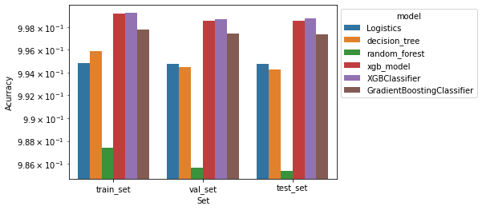
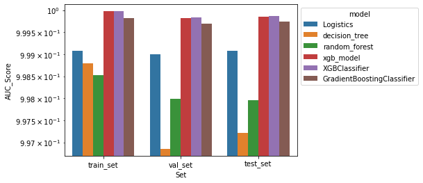
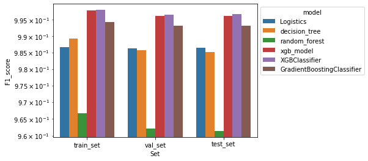
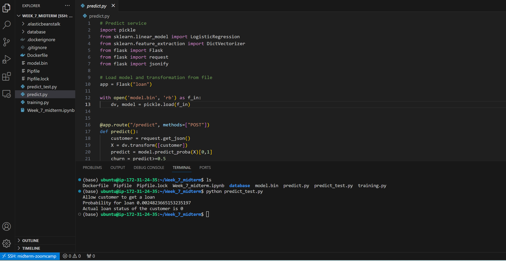

# LOAN PREDICTION
## Project description
- In this project, I will use different machine learning models to predict whether a customer loan is default or not.
- Dataset is taken from 2007 to 2020Q3 with unbalanced dataset (percentage of default loan is about 20%).
- Link to dataset and description from [Kaggle](https://www.kaggle.com/datasets/ethon0426/lending-club-20072020q1)

## EDA and data preparation
- We do some data analysis and data cleaning before fitting models.
- Dataset consists of more than 2 millions records and 145 features
- The column `loan_status` is target variable. In this project we are interested in whether a person is eligible to get a loan or not. That means only two statuses are considered. 
    - Fully Paid status means a person paid back for the loan
    - Charged Off status means a person could not afford to paid for the loan
- We do some data preparation including feature selection, filling missing values

## Training model
- We fit model with different type of algorithms: logistics regression, decision tree, random forest, gradient boosting and extreme gradient boosting.

- The result is on the bar chart. The extreme gradient boosting classifier (XGBClassifier) is chosen for deployment




## Model deployment
- We deploy model with Flask and AWS Elastic Beanstalk. At the end, an API endpoint for loan prediction is provided
### Docker container
    
- Build docker image
    
    ```
    docker build -t loan_predict .
    ```
- Run docker container
    ```
    docker run -it --rm -p 2727:2727 loan_predict
    ```
- Test locally

    ```py
    python predict_test.py
    ```

### Deployment with AWS Elastic Beanstalk
- Initialization Elastic Beanstalk
    ```
    eb init -p Docker -r eu-north-1
    ```
- Create name for Elastic Beanstalk and deploy model on AWS
    ```
    eb create loan_prediction
    ```





